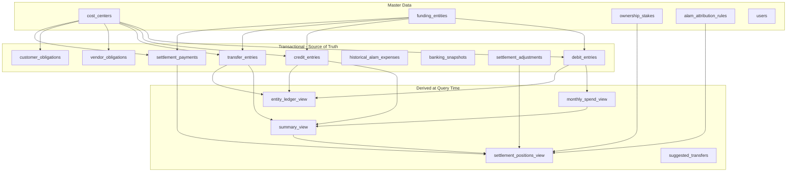
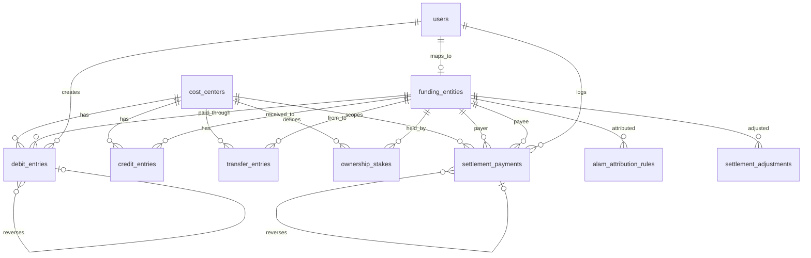

# Hexagro Shareholder Settlement — Database Architecture

**Version:** 1.0  
**Date:** August 28, 2026  
**Sources:**
- [Hexagro_Shareholding_Data (10).xlsx](../Hexagro_Shareholding_Data%20(10).xlsx) — current business Excel workbook
- [hexagro-shareholding-prototype-3 (1).html](../hexagro-shareholding-prototype-3%20(1).html) — confirmed UI/UX prototype

This document defines a production-ready normalized relational schema for the Hexagro shareholder settlement application. The schema treats debits, credits, and transfers as immutable financial transactions, computes settlement positions dynamically, and stores only actual shareholder-to-shareholder payments in a settlement ledger.

---

## Phase 0 — Analysis Summary (Before Schema)

### 1. What the Excel Represents

Hexagro runs **three business units** (Fibre, Chips, Washing). Money flows through **8 funding entities**: 4 shareholders, Payable to Alam, and 3 Union Bank accounts.

**Current Excel workflow** ([Hexagro_Shareholding_Data (10).xlsx](../Hexagro_Shareholding_Data%20(10).xlsx)):

| Sheet | Role | Rows (approx) |
|-------|------|---------------|
| **Lists** | Master data: cost centers, paid-through entities, FY months, categories, ownership %, Alam attribution | 13 |
| **Debit** | Source transactions: business spend (Expense / Raw Materials) + legacy Transfer Fund duplicates | 289 |
| **Credit** | Inflows (Sales) + Transfer Fund (entity-to-entity) | 12 |
| **Fibre_Historical_Exp_by_Alam** | Pre-model Alam-funded Fibre expenses (frozen history) | 31 |
| **Sales** | Monthly invoiced/received per unit | 2 |
| **Outstanding** | Manual vendor/customer balances (informational) | 8 |
| **Banking** | Point-in-time bank snapshot + derived Alam utilisation | manual |
| **Monthly Spend** | Derived: SUMIFS on Debit by month × unit × paid-through | 1009 formulas |
| **Summary** | Derived: FY paid-through breakdown per unit | 144 formulas |
| **Settlement** | Derived: contribution vs fair share per partner per unit + overall | 77 formulas |

**Core Excel business rules (from formulas):**

```
Paid (direct)     = SUM(debits WHERE cost_center AND paid_through = shareholder)
Alam share        = f(net Alam position in Summary, attribution % from Lists)
UBI share         = SUM(Union Bank* summary totals for unit) / eligible_partner_count
Contribution      = Paid + Alam share + UBI share
Fair share        = ownership_% / SUM(ownership_%) × unit_total_contribution
Net               = Contribution − Fair share
Overall net       = Fibre net + Chips net + Washing net (per partner)
Adjusted net      = Overall net + manual adjustment
```

**Excel hidden relationships:**
- Debit → Monthly Spend → Summary → Settlement (pipeline)
- Credit reduces Summary "Credit" column per `received_to` entity
- Transfer Fund appears **twice** in Excel (once in Debit as `paid_through`, once in Credit as `received_to`) — same transfer, double row
- Banking `Alam funds utilised` = `SUMIFS(Debit, paid_through = Payable to Alam)`
- Historical Alam: 66.667% of total folded into Fibre Alam share (per README note)

### 2. What the Prototype Represents

Confirmed UI: [hexagro-shareholding-prototype-3 (1).html](../hexagro-shareholding-prototype-3%20(1).html)

**11 screens** in 4 groups:
- Overview: Dashboard
- Transactions: Debit, Credit, **Transfers** (separate from Credit)
- Reports: Monthly Spend, Summary & Settlement, Purchases, Sales
- Finance: Banking, Ledger Book, Historical Alam Expenses

**New capability not in Excel:** **Settlement Ledger** — actual shareholder-to-shareholder payments that adjust outstanding net without changing underlying transactions.

**Prototype settlement formulas** (documented in `INFO_TOPICS`):

```
Contribution = paid_directly + alam_share + ubi_share
Fair share   = unit_total_cost × ownership_%
Net          = contribution − fair_share
Outstanding  = adjusted_net ± settlement_ledger_effects
```

**Settlement ledger effect** (from `outstandingNet()`):
- Payer (`from`): `outstanding += amount`
- Receiver (`to`): `outstanding -= amount`

**Roles:** Admin (Jagadeesan) = full CRUD + import + log payments; Viewers = read-only, scoped to units they hold shares in.

### 3. Excel vs Prototype — Key Differences

| Area | Excel | Prototype (authoritative for app) |
|------|-------|-----------------------------------|
| Transfers | Duplicated in Debit + Credit as "Transfer Fund" | Single `transfers` table with `from` / `to` |
| Credit types | Sales, Transfer Fund | Sales, Vendor Return, Employee Return, Other Credit |
| Purchases | Only in Outstanding sheet (manual) | Full vendor ledger (billed/paid/balance) |
| Sales | Monthly aggregate sheet | Customer ledger + monthly trend |
| Settlement ledger | Does not exist | First-class `settlement_payments` entity |
| UBI in settlement | README says "excluded" but **formulas include it** | Explicitly included via UBI share |
| Overall adjustment | Manual cells (Jagadeshwaran −₹116,980 / Vellingiri +₹116,980) | Same, stored as adjustments |
| Entity ledger | Implicit in Summary | Dedicated Ledger Book screen (derived) |
| Banking edit | Manual yellow cells | Admin "Edit Snapshot" (point-in-time) |

### 4. Discovered Business Rules

1. **Three transaction classes must never be conflated:**
   - Debit = business cost (Expense / Raw Materials)
   - Credit = business inflow (sales, returns)
   - Transfer = movement between funding entities (not business P&L)

2. **Settlement is NOT the same as entity ledger.** Entity ledger tracks what each funding source put in/took out. Settlement reallocates bank/Alam spend to shareholders by ownership + attribution rules.

3. **Alam attribution is fixed** (50/50 Jagadeesan/Jagadeshwaran, 0 for Vellingiri/Vikas) — independent of who triggered the spend.

4. **Vikas** participates only in Fibre Unit settlement (33.33%); excluded from Chips/Washing.

5. **UBI share divisor** = count of shareholders receiving bank allocation (3 in Fibre for Jagadeesan/Jagadeshwaran/Vellingiri; Vikas gets 0).

6. **Unit nets must sum to ~0** at partner level (Excel validates this in total rows).

7. **Outstanding vendor/customer balances are informational** — explicitly excluded from settlement in Excel README.

8. **Historical Alam** is frozen pre-period data; 66.667% contributes to Fibre Alam share calculation.

### 5. Unsafe Assumptions (Flag for Business)

- Whether README "bank excluded from settlement" is obsolete (formulas + prototype both include UBI)
- How exactly historical Alam 66.667% merges into live Alam share (additive lump vs included in Summary F9)
- Whether Purchases ledger should link to Debit rows or remain independent
- Negative outstanding entries (e.g. Vellingiri Field Work −₹7,464)
- Duplicate forklift sale entries in Credit (₹200k split across 3 rows)
- Whether settlement payments can involve non-shareholder entities (prototype: shareholders only)
- Effective-dating of ownership % changes (Excel has no history)
- Zoho Books import field mapping and deduplication keys

---

## A. Business Understanding

Hexagro is a **multi-unit coconut processing business** co-funded by shareholders. Each expense is tagged to a **cost center** (unit) and records **whose money paid** (`paid_through`). The system answers:

1. How much did each unit spend, and through whom?
2. Given ownership %, who has **over-contributed** vs **under-contributed**?
3. What **actual payments** have shareholders made to each other to settle up?
4. What are outstanding **vendor payables** and **customer receivables** (informational)?
5. What is the current **banking position**?

The Excel is a **transaction journal + formula engine**. The app must become a **transactional system** where reports are computed from stored events, and settlement payments are auditable ledger entries.

---

## B. Problems in Current Excel

- **Transfer double-counting risk**: same transfer in Debit and Credit
- **Derived sheets** (Monthly Spend, Summary, Settlement) can drift if formulas break
- **No settlement payment tracking** — manual reconciliation outside workbook
- **No audit trail** — rows can be overwritten (README says append, but no enforcement)
- **No user access control**
- **README contradicts formulas** on bank/settlement treatment
- **Outstanding/Purchases** maintained manually, disconnected from Debit
- **Inconsistent enums** (`Raw materials` vs `Raw Materials`, `Transfer fund` vs `Transfer Fund`)
- **No reversal/correction** mechanism for financial rows

---

## C. Proposed Architecture



**Principles:**
- Store **events**, compute **positions**
- `DECIMAL(18,2)` for all INR amounts; currency = `INR`
- Financial rows: **posted** (immutable) or **voided** (via reversal row, never hard delete)
- Settlement ledger entries are **independent** of debit/credit — they settle interpersonal balances only
- Multi-table writes wrapped in **DB transactions**

---

## D. Complete Table List

| Table | Type | Purpose |
|-------|------|---------|
| `users` | Master | Auth + role (admin/viewer) |
| `cost_centers` | Master | Fibre / Chips / Washing units |
| `funding_entities` | Master | Shareholders, Alam, 3 bank accounts |
| `user_cost_center_access` | Master | Which units a viewer can see |
| `ownership_stakes` | Master | Partner % per unit, effective-dated |
| `alam_attribution_rules` | Master | % of Alam spend credited per partner |
| `expense_accounts` | Master (optional) | Normalized Zoho account names |
| `debit_entries` | Transaction | Business spend (expense/raw materials) |
| `credit_entries` | Transaction | Business inflows |
| `transfer_entries` | Transaction | Entity-to-entity fund movements |
| `vendor_obligations` | Transaction | Purchase/vendor ledger |
| `customer_obligations` | Transaction | Sales/customer ledger |
| `monthly_sales_summaries` | Transaction/agg | Monthly invoiced vs received (or derive) |
| `historical_alam_expenses` | Transaction (frozen) | Pre-model Alam expenses |
| `banking_snapshots` | Snapshot | Point-in-time bank positions |
| `settlement_adjustments` | Transaction | Manual overall reallocations |
| `settlement_payments` | Transaction | **Settlement ledger** — P2P payments |
| `settlement_payment_events` | Audit | Status history for payments |
| `import_batches` | Audit | Excel/Zoho import tracking |
| `audit_logs` | Audit | Field-level change log |

**Not stored (computed):** monthly spend, summary, settlement positions, entity ledger, suggested transfers, dashboard KPIs.

---

## E. Complete Schema

### `cost_centers`

| Column | Type | Null | Default | Key | Description |
|--------|------|------|---------|-----|-------------|
| id | BIGINT UNSIGNED | NO | | PK | |
| code | VARCHAR(50) | NO | | UQ | e.g. `fibre_unit` |
| name | VARCHAR(100) | NO | | | Fibre Unit |
| is_active | BOOLEAN | NO | true | | |
| created_at | TIMESTAMP | NO | | | |
| updated_at | TIMESTAMP | NO | | | |
| deleted_at | TIMESTAMP | YES | | | Soft delete master only |

### `funding_entities`

| Column | Type | Null | Default | Key | Description |
|--------|------|------|---------|-----|-------------|
| id | BIGINT UNSIGNED | NO | | PK | |
| code | VARCHAR(50) | NO | | UQ | slug |
| name | VARCHAR(150) | NO | | | Display name |
| entity_type | ENUM | NO | | IDX | `shareholder`,`alam`,`bank_cc`,`bank_current`,`bank_term_loan` |
| user_id | BIGINT UNSIGNED | YES | | FK→users | For shareholders |
| is_settlement_eligible | BOOLEAN | NO | true | | Shareholders only |
| is_active | BOOLEAN | NO | true | | |
| created_at/updated_at/deleted_at | | | | | |

### `ownership_stakes`

| Column | Type | Null | Default | Key | Description |
|--------|------|------|---------|-----|-------------|
| id | BIGINT UNSIGNED | NO | | PK | |
| cost_center_id | BIGINT UNSIGNED | NO | | FK | |
| funding_entity_id | BIGINT UNSIGNED | NO | | FK | Shareholder |
| share_percent | DECIMAL(8,4) | NO | | | e.g. 0.2222 |
| effective_from | DATE | NO | | | |
| effective_to | DATE | YES | | | NULL = current |
| created_at/updated_at | | | | | |
| **UQ** | (cost_center_id, funding_entity_id, effective_from) | | | | |

### `alam_attribution_rules`

| Column | Type | Null | Default | Key | Description |
|--------|------|------|---------|-----|-------------|
| id | BIGINT UNSIGNED | NO | | PK | |
| funding_entity_id | BIGINT UNSIGNED | NO | | FK | Shareholder |
| attribution_percent | DECIMAL(8,4) | NO | | | 0.5, 0, etc. |
| effective_from | DATE | NO | | | |
| effective_to | DATE | YES | | | |
| **UQ** | (funding_entity_id, effective_from) | | | | |

### `debit_entries`

| Column | Type | Null | Default | Key | Description |
|--------|------|------|---------|-----|-------------|
| id | BIGINT UNSIGNED | NO | | PK | |
| transaction_date | DATE | NO | | IDX | |
| cost_center_id | BIGINT UNSIGNED | NO | | FK, IDX | |
| category | ENUM | NO | | IDX | `expense`,`raw_materials` |
| account_name | VARCHAR(150) | NO | | | Zoho account |
| paid_through_entity_id | BIGINT UNSIGNED | NO | | FK, IDX | Funding source |
| description | TEXT | YES | | | |
| amount | DECIMAL(18,2) | NO | | CHK ≥0 | Always positive |
| currency | CHAR(3) | NO | INR | | |
| status | ENUM | NO | posted | IDX | `draft`,`posted`,`voided` |
| voided_at | TIMESTAMP | YES | | | |
| voided_by | BIGINT UNSIGNED | YES | | FK→users | |
| reversal_of_id | BIGINT UNSIGNED | YES | | FK→debit_entries | |
| import_batch_id | BIGINT UNSIGNED | YES | | FK | |
| external_ref | VARCHAR(100) | YES | | UQ* | Zoho/import dedup |
| created_by | BIGINT UNSIGNED | NO | | FK | |
| updated_by | BIGINT UNSIGNED | YES | | FK | |
| created_at/updated_at | TIMESTAMP | NO | | | |

*Partial unique on `(external_ref)` where not null.

### `credit_entries`

| Column | Type | Null | Default | Key | Description |
|--------|------|------|---------|-----|-------------|
| id | BIGINT UNSIGNED | NO | | PK | |
| transaction_date | DATE | NO | | IDX | |
| cost_center_id | BIGINT UNSIGNED | NO | | FK | |
| credit_type | ENUM | NO | | | `sales`,`vendor_return`,`employee_return`,`other_credit` |
| received_to_entity_id | BIGINT UNSIGNED | NO | | FK, IDX | |
| description | TEXT | YES | | | |
| amount | DECIMAL(18,2) | NO | | CHK ≥0 | |
| currency | CHAR(3) | NO | INR | | |
| status | ENUM | NO | posted | | `draft`,`posted`,`voided` |
| voided_at/voided_by/reversal_of_id | | | | | Same pattern |
| import_batch_id/external_ref | | | | | |
| created_by/updated_by/created_at/updated_at | | | | | |

### `transfer_entries`

| Column | Type | Null | Default | Key | Description |
|--------|------|------|---------|-----|-------------|
| id | BIGINT UNSIGNED | NO | | PK | |
| transaction_date | DATE | NO | | IDX | |
| cost_center_id | BIGINT UNSIGNED | NO | | FK | |
| from_entity_id | BIGINT UNSIGNED | NO | | FK, IDX | |
| to_entity_id | BIGINT UNSIGNED | NO | | FK, IDX | |
| amount | DECIMAL(18,2) | NO | | CHK >0 | |
| note | TEXT | YES | | | |
| currency | CHAR(3) | NO | INR | | |
| status | ENUM | NO | posted | | |
| voided_at/voided_by/reversal_of_id | | | | | |
| **CHK** | from_entity_id != to_entity_id | | | | |
| created_by/created_at/updated_at | | | | | |

### `vendor_obligations` (Purchases)

| Column | Type | Null | Default | Key | Description |
|--------|------|------|---------|-----|-------------|
| id | BIGINT UNSIGNED | NO | | PK | |
| cost_center_id | BIGINT UNSIGNED | NO | | FK | |
| vendor_name | VARCHAR(200) | NO | | IDX | |
| billed_amount | DECIMAL(18,2) | YES | | | NULL = TBD |
| paid_amount | DECIMAL(18,2) | NO | 0 | | |
| notes | TEXT | YES | | | |
| status | ENUM | NO | open | | `open`,`closed`,`voided` |
| created_by/updated_by/created_at/updated_at | | | | | |

**Derived:** `balance = billed_amount - paid_amount` (not stored).

### `customer_obligations` (Sales ledger)

Same structure with `customer_name`, `invoiced_amount`, `received_amount`.

### `historical_alam_expenses`

| Column | Type | Null | Default | Key | Description |
|--------|------|------|---------|-----|-------------|
| id | BIGINT UNSIGNED | NO | | PK | |
| transaction_date | DATE | NO | | | |
| account_name | VARCHAR(150) | NO | | | |
| description | TEXT | YES | | | |
| amount | DECIMAL(18,2) | NO | | | |
| is_locked | BOOLEAN | NO | true | | Immutable after import |
| created_at/updated_at | | | | | |

Config constant or `system_settings`: `historical_alam_contribution_percent = 0.666667`.

### `banking_snapshots`

| Column | Type | Null | Default | Key | Description |
|--------|------|------|---------|-----|-------------|
| id | BIGINT UNSIGNED | NO | | PK | |
| as_of_date | DATE | NO | | UQ | |
| cc_limit | DECIMAL(18,2) | NO | | | |
| cc_utilised | DECIMAL(18,2) | NO | | | |
| current_balance | DECIMAL(18,2) | NO | | | |
| term_loan_outstanding | DECIMAL(18,2) | NO | | | |
| alam_opening_payable | DECIMAL(18,2) | NO | 0 | | |
| alam_inflows_fy | DECIMAL(18,2) | NO | 0 | | |
| created_by | BIGINT UNSIGNED | NO | | FK | |
| created_at/updated_at | | | | | |

**Derived:** `cc_available = cc_limit - cc_utilised`; `alam_utilised = SUM(debits WHERE paid_through=alam)`; `alam_closing = opening + inflows - utilised`.

### `settlement_adjustments`

| Column | Type | Null | Default | Key | Description |
|--------|------|------|---------|-----|-------------|
| id | BIGINT UNSIGNED | NO | | PK | |
| funding_entity_id | BIGINT UNSIGNED | NO | | FK | Partner |
| adjustment_amount | DECIMAL(18,2) | NO | | | +/- vs overall net |
| reason | TEXT | NO | | | |
| effective_date | DATE | NO | | | |
| created_by | BIGINT UNSIGNED | NO | | FK | |
| created_at/updated_at | | | | | |

### `settlement_payments` (Settlement Ledger)

| Column | Type | Null | Default | Key | Description |
|--------|------|------|---------|-----|-------------|
| id | BIGINT UNSIGNED | NO | | PK | |
| scope_type | ENUM | NO | | IDX | `unit`,`overall` |
| cost_center_id | BIGINT UNSIGNED | YES | | FK | Required when scope=unit |
| payer_entity_id | BIGINT UNSIGNED | NO | | FK, IDX | Shareholder who paid |
| payee_entity_id | BIGINT UNSIGNED | NO | | FK, IDX | Shareholder who received |
| payment_date | DATE | NO | | IDX | |
| amount | DECIMAL(18,2) | NO | | CHK >0 | |
| reference | VARCHAR(100) | YES | | | UPI ref, etc. |
| note | TEXT | YES | | | |
| status | ENUM | NO | posted | IDX | `posted`,`voided` |
| voided_at | TIMESTAMP | YES | | | |
| voided_by | BIGINT UNSIGNED | YES | | FK | |
| reversal_of_id | BIGINT UNSIGNED | YES | | FK | |
| created_by | BIGINT UNSIGNED | NO | | FK | |
| created_at/updated_at | | | | | |
| **CHK** | payer != payee | | | | |
| **CHK** | scope_type=unit ⇒ cost_center_id NOT NULL | | | | |

### `import_batches` + `audit_logs`

Standard Laravel patterns for import tracking and polymorphic audit.

---

## F. Relationship Diagram



**Cascade policy:**
- Master data: `ON DELETE RESTRICT`
- Financial transactions: **never cascade delete** — void only
- `cost_center_id` / `funding_entity_id`: `RESTRICT`

---

## G. Excel → Database Mapping (Key Fields)

| Excel Sheet | Excel Column | Meaning | Target Table | Target Column | Transformation |
|-------------|--------------|---------|--------------|---------------|----------------|
| Lists | Cost Centers | Business unit | cost_centers | name | Map Fibre/Chips/Washing only |
| Lists | Paid Through | Funding entity | funding_entities | name, entity_type | Classify shareholder/alam/bank |
| Lists | Shareholding % | Ownership | ownership_stakes | share_percent | Per unit columns H-J |
| Lists | Alam attribution | Alam split | alam_attribution_rules | attribution_percent | Rows 10-13 |
| Debit | Date | Transaction date | debit_entries | transaction_date | Excel serial → date |
| Debit | Cost Center | Unit | debit_entries | cost_center_id | FK lookup |
| Debit | Type | Category | debit_entries | category | Normalize case; exclude Transfer Fund → transfer_entries |
| Debit | Account | GL account | debit_entries | account_name | |
| Debit | Paid Through | Funding source | debit_entries | paid_through_entity_id | FK |
| Debit | Description | Narration | debit_entries | description | |
| Debit | Total Amount | Spend | debit_entries | amount | DECIMAL(18,2) |
| Credit | Type=Sales etc. | Inflow type | credit_entries | credit_type | Map enums |
| Credit | Received To | Destination | credit_entries | received_to_entity_id | FK |
| Credit | Type=Transfer Fund | **Not credit** | transfer_entries | from/to/amount | Pair with matching Debit row OR infer from received_to |
| Sales | Month/CC/Invoiced/Received | Monthly sales | monthly_sales_summaries OR customer_obligations | | Prefer customer ledger in app |
| Outstanding | Party/Amount | AR/AP info | vendor_obligations / customer_obligations | | By kind |
| Banking | Yellow cells | Snapshot | banking_snapshots | respective columns | |
| Fibre_Historical | All cols | Frozen history | historical_alam_expenses | | |
| Settlement | Adjustment | Manual true-up | settlement_adjustments | adjustment_amount | Rows 27-30 col C |
| N/A | N/A | P2P settlement | settlement_payments | all | New in app; starts empty |

**Do NOT migrate:** Monthly Spend, Summary, Settlement computed sheets.

---

## H. Prototype → Database Mapping (Key Screens)

| Screen | UI Field/Action | Table(s) | Read/Write | Calculation |
|--------|-----------------|----------|------------|-------------|
| Dashboard KPIs | Total spend | debit_entries | Read | SUM by date range + unit |
| Dashboard | Payables | vendor_obligations | Read | SUM(billed−paid) |
| Dashboard | Receivables | customer_obligations | Read | SUM(invoiced−received) |
| Debit list | All columns | debit_entries + FKs | R/W admin | |
| Credit list | All columns | credit_entries | R/W admin | |
| Transfers | from/to/amount | transfer_entries | R/W admin | |
| Monthly Spend | expenses/raw/total | debit_entries | Read only | GROUP BY month, unit |
| Settlement | Paid/Alam/UBI/Net | computed | Read | See section I |
| Settlement | Log Payment | settlement_payments | W admin | Adjusts outstanding |
| Settlement | Transfers to Settle | computed | Read | Greedy algorithm |
| Purchases | vendor/billed/paid | vendor_obligations | R/W admin | balance derived |
| Sales | customer/invoiced/received | customer_obligations | R/W admin | |
| Banking | snapshot fields | banking_snapshots | R/W admin | |
| Ledger Book | Dr/Cr lines | debit/credit/transfer | Read | entityLedgerRows logic |
| Historical Alam | entries | historical_alam_expenses | R/W admin | |

---

## I. Financial Calculation Logic

### Per-unit settlement (for each shareholder S in unit U)

```
paid_directly(S,U) = SUM(debit_entries.amount WHERE cost_center=U AND paid_through=S AND status=posted)

alam_net(U) = SUM(debit_entries WHERE paid_through=Alam AND cost_center=U)
            - SUM(credit_entries WHERE received_to=Alam AND cost_center=U)
            + historical_alam_contribution  -- Fibre only; confirm with business

alam_share(S,U) = alam_attribution(S) × alam_net(U)  -- with Excel's split logic for Jagadeesan/Jagadeshwaran using net/2

ubi_pool(U) = SUM(summary_total(entity) FOR entity IN bank_entities)

ubi_share(S,U) = IF S eligible THEN ubi_pool(U) / eligible_count(U) ELSE 0

contribution(S,U) = paid_directly + alam_share + ubi_share

unit_total_cost(U) = SUM(contribution(S,U) FOR ALL partners in U)

fair_share(S,U) = ownership(S,U) × unit_total_cost(U)

net(S,U) = contribution(S,U) - fair_share(S,U)
```

### Overall settlement

```
overall_net(S) = net(S,Fibre) + net(S,Chips) + net(S,Washing)  [null units = 0]
adjusted_net(S) = overall_net(S) + settlement_adjustments(S)
```

### Outstanding after ledger

```
outstanding(S, scope) = base_net(S, scope)
    + SUM(payments WHERE payer=S AND in_scope)
    - SUM(payments WHERE payee=S AND in_scope)
```

**Balanced when** `|outstanding| < 1.00` (₹1 tolerance, matching prototype).

### Entity ledger (per entity E)

```
Cr (+) = debits paid_through E + transfers to E
Dr (−) = credits received_to E + transfers from E
running_balance = cumulative sum
```

---

## J. Settlement Ledger Design

**Overall settlement** = computed net position (who should pay/receive based on contribution vs fair share).

**Individual settlement** = rows in `settlement_payments` representing actual cash/UPI between shareholders.

Example: Jagadeesan adjusted net = +₹189,366 (to receive). Actual payments:
- Vikas → Jagadeesan ₹50,000
- Jagadeshwaran → Jagadeesan ₹30,000

Each payment is an immutable posted row. Voiding creates a reversal row (negative entry or status=voided with audit).

**Effects:**
1. Individual balance: outstanding moves toward zero
2. Overall settlement: unchanged (derived from transactions)
3. Reports: ledger shows payment history; outstanding column updates
4. Remaining payable/receivable: `outstanding` column
5. Status: Balanced / To Pay / To Receive based on outstanding sign

---

## K. Transaction Lifecycle

```mermaid
sequenceDiagram
    participant Admin
    participant App
    participant DB

    Admin->>App: Create debit (expense)
    App->>DB: INSERT debit_entries (posted)
    Note over DB: Unit spend increases

    App->>App: Recompute settlement positions
    Note over App: Net positions shift

    Admin->>App: Log settlement payment A→B
    App->>DB: BEGIN TRANSACTION
    App->>DB: INSERT settlement_payments
    App->>DB: INSERT audit_log
    App->>DB: COMMIT
    Note over App: Outstanding nets adjust; underlying debits unchanged

    Admin->>App: Void payment
    App->>DB: UPDATE status=voided OR INSERT reversal
```

---

## L. Data Integrity Rules

| Rule | Enforcement |
|------|-------------|
| Expense allocations = expense total | Single paid_through per debit row; no split allocations in v1 |
| No duplicate imports | `external_ref` unique per source |
| Transfer not double-counted | Single `transfer_entries` row; reject Transfer Fund in debit import |
| Settlement payment payer ≠ payee | CHECK constraint |
| Voided rows excluded from sums | `WHERE status = posted` on all calculations |
| Unit ownership sums to 1.0 | Validation on `ownership_stakes` per unit per date |
| Alam attribution sums to 1.0 | Validation on rules |
| Financial immutability | No DELETE on posted; void only |
| Concurrent settlement logging | DB transaction + row-level locking on partner scope |
| Cancelled settlements | `status=voided` excluded from outstanding calc |

---

## M. Audit Strategy

- All financial tables: `created_by`, `created_at`; edits only in `draft` status
- Posted records: correction via `reversal_of_id` + new correcting row
- `settlement_payment_events` for status transitions
- `audit_logs` polymorphic on amount/date/entity changes
- Banking snapshots: new row per edit (or version column); keep history
- Settlement adjustments: require `reason` text; admin only

---

## N. Migration Plan

```
Excel → staging tables → validation → transform → production
```

1. **Master data**: Lists sheet → cost_centers, funding_entities, ownership_stakes, alam_attribution_rules
2. **Debits**: Debit sheet → debit_entries (skip Transfer Fund rows)
3. **Transfers**: Deduplicate Debit+Credit Transfer Fund pairs → transfer_entries
4. **Credits**: Credit sheet (non-transfer) → credit_entries
5. **Historical Alam**: Fibre_Historical → historical_alam_expenses
6. **Outstanding**: → vendor_obligations + customer_obligations
7. **Sales**: Sales sheet → monthly_sales_summaries and/or customer_obligations
8. **Banking**: Latest Banking row → banking_snapshots
9. **Adjustments**: Settlement overall adjustment column → settlement_adjustments
10. **Validate**: Recompute settlement in app; compare to Excel Settlement sheet within ₹1 tolerance
11. **Settlement payments**: Start empty (no historical data)

---

## O. Business Clarifications Required

1. Confirm UBI/bank spend **is included** in settlement (prototype + Excel formulas) despite README wording
2. Exact formula for folding **historical Alam 66.667%** into Fibre Alam share
3. Should **Purchases** link to underlying debit rows, or stay as standalone obligations?
4. How to handle **negative outstanding** amounts (credits to vendor)?
5. Who can create **settlement adjustments**, and do they need approval workflow?
6. **Vikas UBI share = 0** — confirm permanent rule
7. **UBI divisor = 3** (not 4) in Fibre — confirm Vikas exclusion
8. Deduplication key for **Zoho Books import** (expense ID?)
9. Are **settlement payments** always between shareholders, never involving Alam/banks?
10. Fiscal year start: **April 1** confirmed?
11. Migrate **289 debits** as opening posted balance or full history from FY start only?

---

## P. Recommended Implementation Order

1. **Database migrations** — master tables + financial transaction tables
2. **Seeders** — cost centers, funding entities, ownership, Alam rules, users
3. **Import pipeline** — Excel → staging → production with validation report
4. **Calculation service** — Summary, Settlement, Entity Ledger (unit tests against Excel totals)
5. **Settlement payment API** — CRUD + void + outstanding recalculation
6. **REST/API endpoints** — per API Operations section below
7. **Report caching** (optional) — materialized views if performance needed
8. **UI integration** — wire prototype screens to API
9. **Zoho import** — after Excel migration validated
10. **Audit dashboard** — admin review of voids/adjustments

---

## API Operations (Summary)

| Operation | Tables | Transaction Boundary |
|-----------|--------|---------------------|
| Create/void debit | debit_entries, audit_logs | Single DB txn |
| Create/void credit | credit_entries | Single DB txn |
| Create transfer | transfer_entries | Single DB txn |
| Log settlement payment | settlement_payments, audit_logs | Single DB txn; validate scope |
| Void settlement payment | settlement_payments | Status update + audit |
| Get settlement positions | computed | Read-only |
| Get settlement ledger | settlement_payments | Read-only |
| Import Excel batch | staging → production | Per-batch txn with rollback |
| Update banking snapshot | banking_snapshots | Insert new version |

---

## Indexing Recommendations

- `debit_entries (cost_center_id, transaction_date, status)`
- `debit_entries (paid_through_entity_id, status)`
- `credit_entries (cost_center_id, transaction_date, status)`
- `transfer_entries (cost_center_id, from_entity_id, to_entity_id)`
- `settlement_payments (scope_type, cost_center_id, payment_date, status)`
- `settlement_payments (payer_entity_id, payee_entity_id)`
- `ownership_stakes (cost_center_id, effective_from, effective_to)`

---

## Source of Truth Summary

| Metric | Source |
|--------|--------|
| Unit spend | `debit_entries` (posted) |
| Funding by entity | `debit_entries` + `credit_entries` + `transfer_entries` |
| Settlement net | Computed from above + ownership + Alam rules |
| Settlement payments | `settlement_payments` only |
| Outstanding AR/AP | `vendor_obligations` / `customer_obligations` |
| Banking position | `banking_snapshots` (latest as_of_date) |
| Balances | **Never** stored as sole source of truth |
